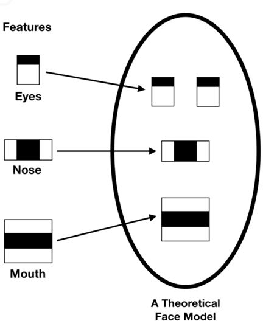
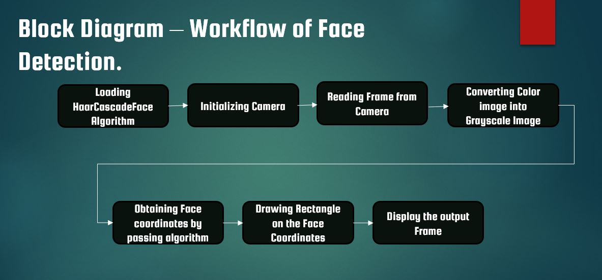

# Face detection and Tracking

this is a part of my 30 day journey to learn Artificial Intelligence by doing practical projects. On my 5th day I made this project.

If you are using any other external webCam, in faceDetection.py on line 15: cam = cv2.VideoCapture(0) change the value passed to VideoCapture from 0 to 1 or 2.

The alogrithm used is Haarcascade Frontal Face Algorithm

It is based on the Haar Wavelet technique to analyze pixels in the image into squares by function.This uses machine learning techniques to get a high degree of accuracy from what is called “training data”.This uses “integral image” concepts to compute the “features” detected.Haar Cascades use the Adaboost learning algorithm which selects a small number of important features from a large set to give an efficient result of classifiers.

